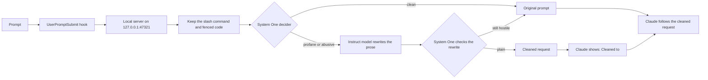

# claudetiquette

A Claude Code plugin that turns a rude prompt into a plain request before Claude acts on it.

Two models sit in front of Claude. A System One model decides whether the wording is profane or abusive. An instruct model rewrites it. Neither step calls a hosted chat API. Laya and Qwen are the defaults, not the only choices.

```text
i already told not fucking touch it
→ as per our previous discussion, dont touch this
```

## Architecture



The `SessionStart` hook starts that server and leaves it running.

| Slot | Job | Default | You can use |
| --- | --- | --- | --- |
| Decider | Label the prose `clean`, `profane`, or `abusive`. It does not write the new sentence. | [Laya](https://huggingface.co/convaiinnovations/laya), on this machine | Any other System One model, including [Jev](https://www.typesafe.ai/) |
| Rewriter | Rewrite only the flagged prose. The decider then checks that rewrite. | `Qwen/Qwen2.5-0.5B-Instruct` | Any other instruct model. Set `CLAUDETIQUETTE_MODEL` |

A bare `/help`, a clean request, and a message sent while Claude is already working never reach either model.

## Install

You need Claude Code and Python 3.10 or newer.

```bash
claude plugin marketplace add zahlekhan/claudetiquette
claude plugin install claudetiquette@claudetiquette
```

Quit Claude Code and start it again. A session that is already open does not pick up the plugin.

The first launch creates `~/.local/share/claudetiquette/` and downloads two models into the Hugging Face cache:

- [convaiinnovations/laya](https://huggingface.co/convaiinnovations/laya) decides
- [Qwen/Qwen2.5-0.5B-Instruct](https://huggingface.co/Qwen/Qwen2.5-0.5B-Instruct) rewrites

Until the log says `ready`, prompts pass through unchanged.

```bash
tail -f ~/.local/share/claudetiquette/ensure.log
```

Try one sentence after that, without opening Claude:

```bash
~/.local/share/claudetiquette/venv/bin/claudetiquette clean "i already told not fucking touch it"
```

To load this checkout for one session instead:

```bash
claude --plugin-dir /path/to/claudetiquette
```

## What you see

A rewritten prompt prints a line in Claude Code:

```text
UserPromptSubmit says: Cleaned to: as per our previous discussion, dont touch this
```

Claude is told to follow that sentence and to ignore the original wording. A normal request prints nothing.

The original sentence is still part of the turn. Claude Code can add context here, and it can block a prompt. It cannot replace the prompt text. This plugin does not block, because blocking would drop the request.

## What it leaves alone

- A request with no profanity and no insult. Blunt is fine.
- A bare slash command such as `/help`. On `/commit fix the bug`, only the words after the command are eligible.
- Code inside a fence. The fence is copied through unchanged.
- A message sent while Claude is already working. Claude Code delivers that as a mid-turn note, and this hook does not see it. Send it again as its own prompt.
- Prose longer than 2,000 characters. Claude is told to follow the request and ignore the hostile wording, and the local model does not rewrite the whole message.

If the rewrite still comes back hostile, the original prompt is left alone.

## Turn it off

```bash
claude plugin disable claudetiquette@claudetiquette
```

If an older install named `prompt-clean` is still enabled, disable that too:

```bash
claude plugin disable prompt-clean@prompt-clean
```

## Settings

| Variable | Default | Meaning |
| --- | --- | --- |
| `CLAUDETIQUETTE_MODEL` | `Qwen/Qwen2.5-0.5B-Instruct` | Any instruct model. Qwen is only the default. |
| `CLAUDETIQUETTE_DEVICE` | `auto` | `cpu`, `mps`, `cuda`, or `auto` |
| `CLAUDETIQUETTE_PORT` | `47321` | Local server, bound to 127.0.0.1 |
| `CLAUDETIQUETTE_DATA` | `~/.local/share/claudetiquette` | Install and log directory |

The server does not write the prompt to the log.

## Develop

```bash
python3 -m unittest discover -s tests
claude plugin validate .
```

The tests stub Laya and the rewrite model. After you change the plugin, bump `version` in `.claude-plugin/plugin.json`, or delete `~/.local/share/claudetiquette/installed-version`, then start a new session.
